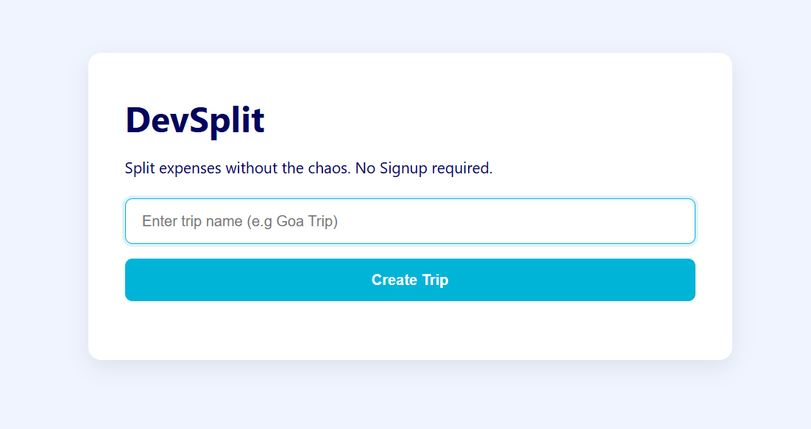
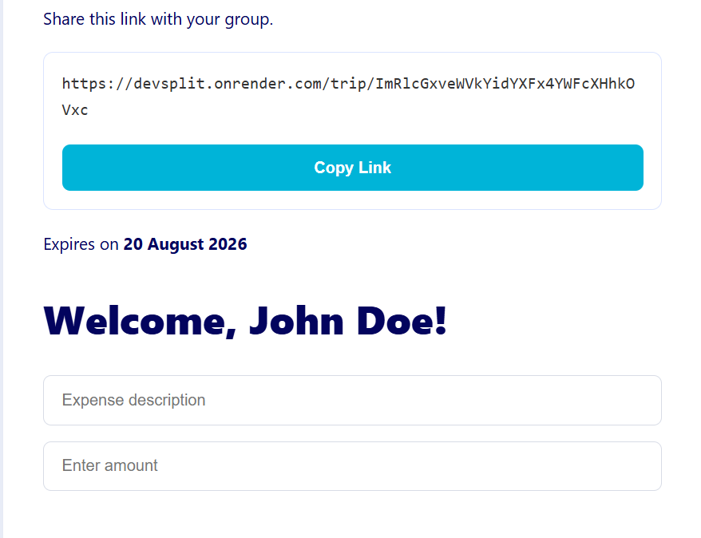
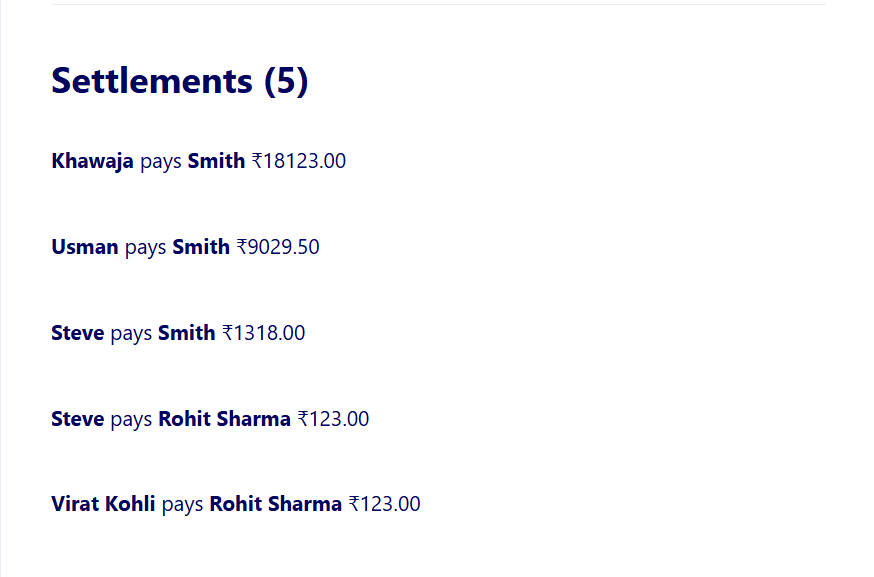
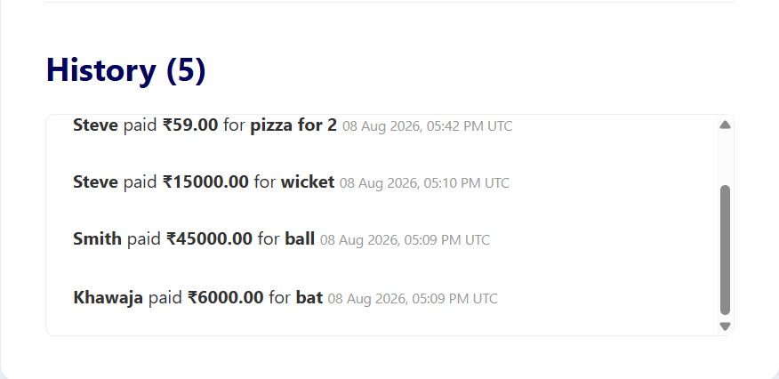

# DevSplit

A lightweight group expense splitter for college trips — no signup required.

**Live Demo:** https://devsplit.onrender.com

---

## The Problem

Splitting trip expenses over WhatsApp is chaos. Splitwise requires everyone
to sign up and download an app. DevSplit sits in the middle — share a link,
everyone joins, expenses get tracked, and the app tells you exactly who pays
whom to settle everything.

---

## Features

- No signup required — just share a link
- Persistent sessions — close the tab, reopen the link, you're still recognized
- Add, edit, and delete expenses — payer only
- Equal split among selected participants
- Settlement algorithm for automatically calculating who owes whom
- Auto-expiring trips — links expire after 10 days
- Supports multiple trips simultaneously per browser
- Input validation and edge case handling
- PostgreSQL database in production
- Responsive interface

---

## Screenshots

### Create a Trip



### Trip Dashboard



### Settlements 



### Expense History



---

## Tech Stack

| Layer | Technology |
|---|---|
| Backend | Python, Flask |
| Database | PostgreSQL (production), SQLite (development) |
| ORM | SQLAlchemy |
| Frontend | HTML, CSS, Vanilla JavaScript |
| Auth | Cookie-based persistent sessions — no login required |
| Deployment | Render |

---

## How It Works

### 1. Create a Trip

Enter a trip name and DevSplit generates a unique shareable link.

### 2. Join

Participants open the link and choose their name. No account or signup is
required.

### 3. Add Expenses

A participant records the expense description, amount, and the participants
sharing the expense.

DevSplit automatically calculates each person's share.

### 4. Settle Up

The application calculates each participant's net balance:

```text
Net Balance = Total Paid - Total Owed
```

Participants with positive balances are creditors, while participants with
negative balances are debtors.

The settlement algorithm then matches creditors and debtors until all
balances are settled.

---

## The Settlement Algorithm

DevSplit uses a greedy approach to simplify settlements.

1. Calculate each participant's net balance.
2. Separate participants into creditors and debtors.
3. Sort both groups by balance.
4. Match the largest creditor with the largest debtor.
5. Settle the smaller outstanding amount.
6. Remove a participant once their balance reaches zero.
7. Continue until all balances are settled.

For N participants, this produces at most N-1 settlement transactions.

---

## Session Architecture

DevSplit uses persistent browser sessions to identify participants without
requiring traditional accounts or login.

- Each trip is associated with a unique participant session token.
- Multiple trip tokens can be stored simultaneously in the same browser.
- Returning to a trip link automatically recognizes the participant.
- Expired trip sessions are cleaned up automatically.
- Sessions have a 30-day lifetime.

---

## Setup

Clone the repository:

```bash
git clone https://github.com/Rohitk-18/DevSplit.git
cd DevSplit
```

Create and activate a virtual environment:

```bash
python -m venv venv
venv\Scripts\activate
```

Install dependencies:

```bash
pip install -r requirements.txt
```

Create a `.env` file:

```env
SECRET_KEY=your-secret-key-here
DATABASE_URL=sqlite:///DevSplit.db
```

Run the application:

```bash
python app.py
```

Open:

```text
http://127.0.0.1:5000
```

---

## Known Limitations

- Equal splits only — unequal/custom splits are not currently supported
- Sessions are browser-based — different devices require rejoining
- No admin panel
- Free Render instance may experience cold starts after inactivity

---

## Production

DevSplit is deployed on Render with PostgreSQL as the production database.

**Live Demo:** https://devsplit.onrender.com